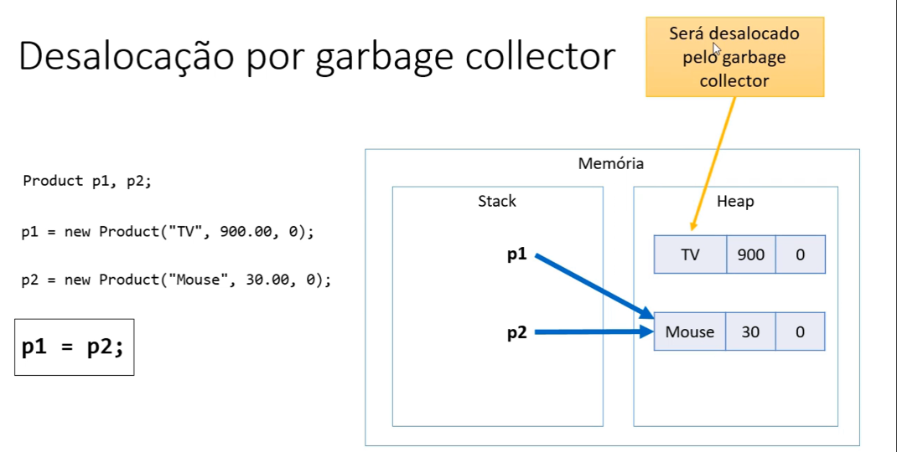
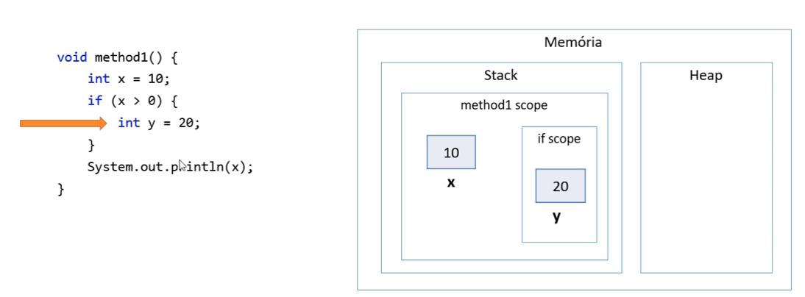
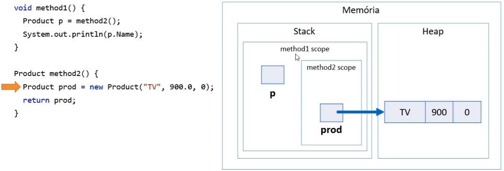

<h1> Garbage Collector

* É um processo que automatiza o gerenciamento de memória de um programa em execução.
* O Garbage collector monitora os objetos alocados dinamicamente pelo program a(no heap), desalocando aqueles que não estão mais sendo utilizados.

<h1> Desalocação por escopo

**Outro exemplo:**

<h2> Resumo

* Objetos alocados dinamicamente, quando não possuem mais referência, serão desalocados pelo garbage collector.
* Variáveis locais são sesalocadas imediatamente assim que seu escopo local sai de execução.
