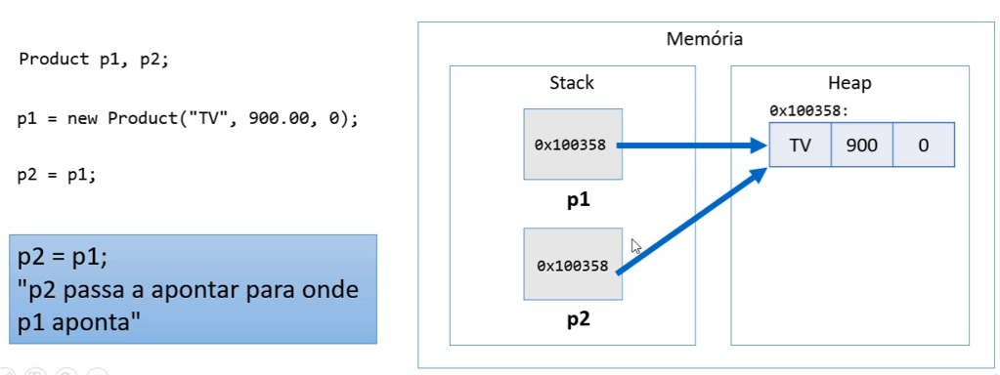
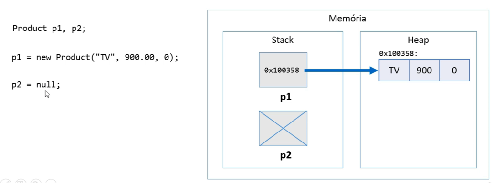
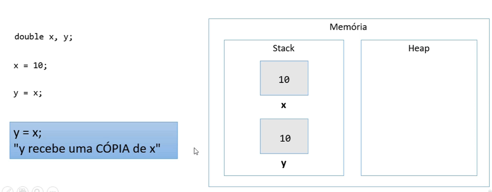
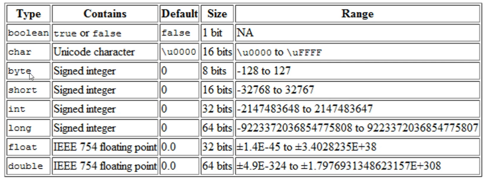
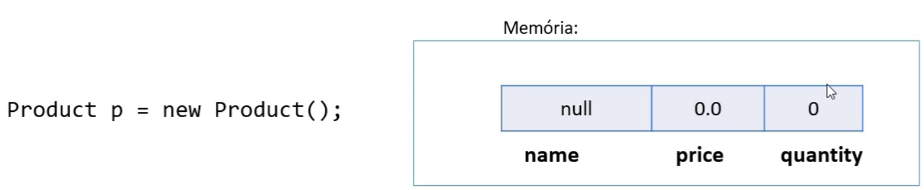
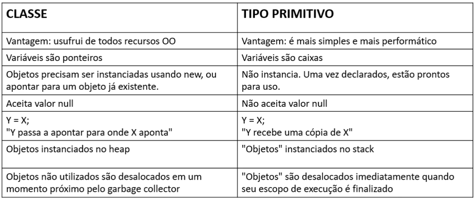

<h1> Classes são tipos referência

Variáveis cujo tipo são classes não devem ser entendidas como caixas, mas sim "tentátucos" (ponteiros) para caixas



<h1> Valor "null"

Tipos referência aceitam o valor "null", que indica que a variável aponta pra ninguém.



<h1> Tipos primitivos são tipos valor

Em Java, tipos primitivos são tipos valor. Tipos valor são CAIXAS e não ponteiros.





<h1> Tipos primitivos e inicialização

* Demo:

```java
intp p;
System.out.println(p); // erro: variável não iniciada

p = 10;
System.out.println(p);
```


<h1> Valores padrão

* Quando alocamos (new) qualquer tipo estruturado (classe ou array), são atribuídos valores padrão aos seus elementos.
  * número: 0
  * boolean: false
  * char: caractere código 0
  * objeto: null




<h1> Tipos referência vs. Tipos valor


