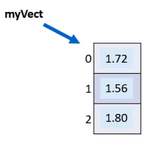
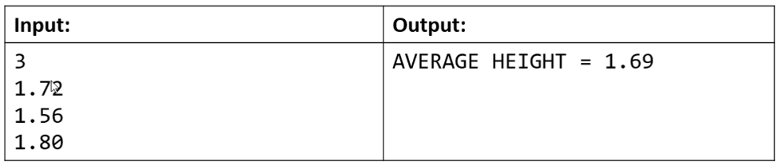
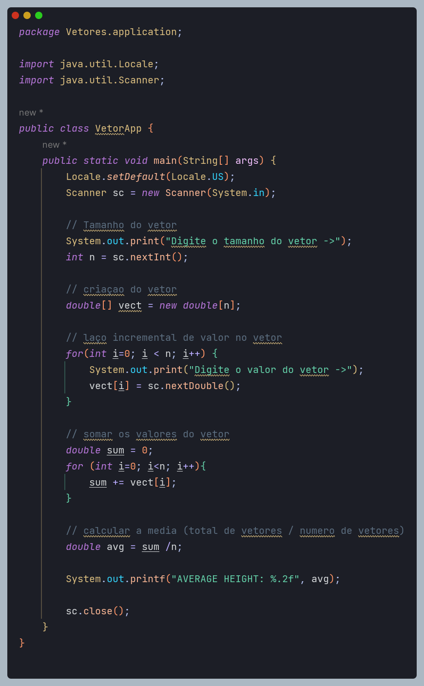

<h1> Checklist

* Revisão do conceito de vetor
* Declaração e instanciação
* Manipulação de vetor de elementos tipo valor (tipo primitivo)
* Manipulação de vetor de elementos tipo referência (classe)
* Acesso aos elementos
* Propriedade length

<h1> Vetores

* Em programação, "vetor" é o noome dado a arranjos unidimensionais
* Arranjo (Array) é uma estrutura de dados:
  * Homogênea (dados do mesmo tipo)
  * Ordenada (elementos acessados por meio de posições)
  * Alocada de uma vez só, em um bloco contíguio de memória
* Vantagens:
  * Acesso imediato aos elementos pela sua posicão
* Desvantagens:
  * Tamanho fixo
  * Dificuldade para se realizar inserções e deleções

<h1> Problema exemplo 1

Fazer um programa para ler um número N e a altura de N pessoas. Armazene as N alturas em um vetor. Em seguida, mostrar a altura média dessas pessoas.

**Exemplo:**

