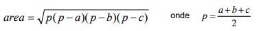
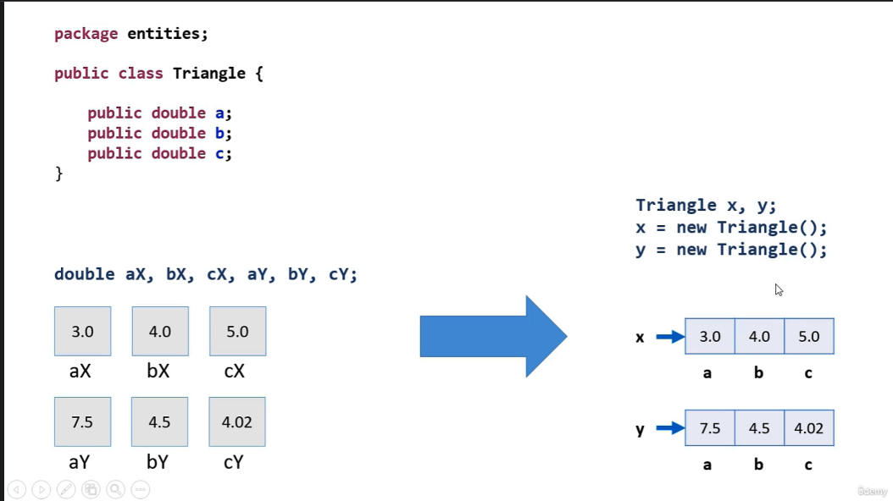
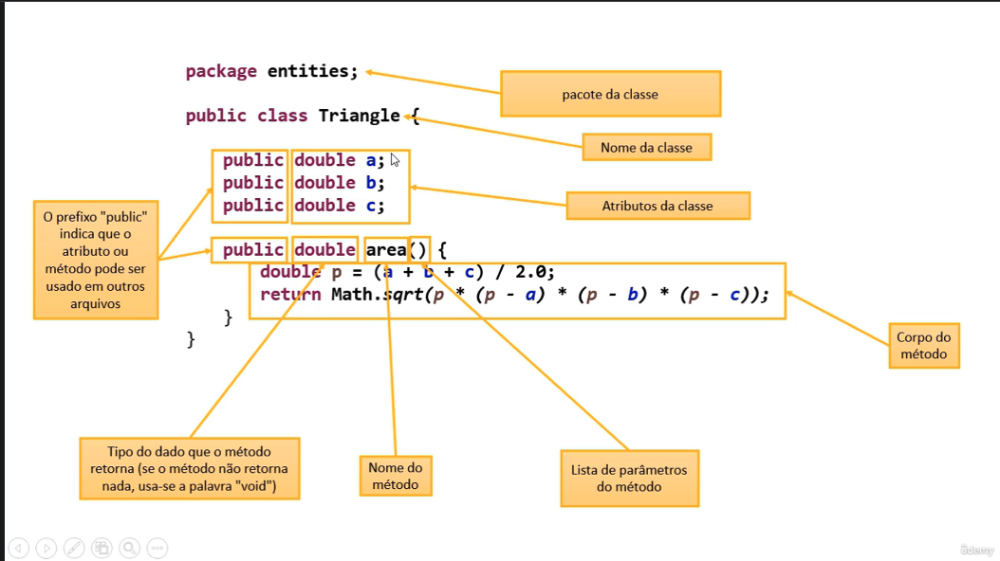
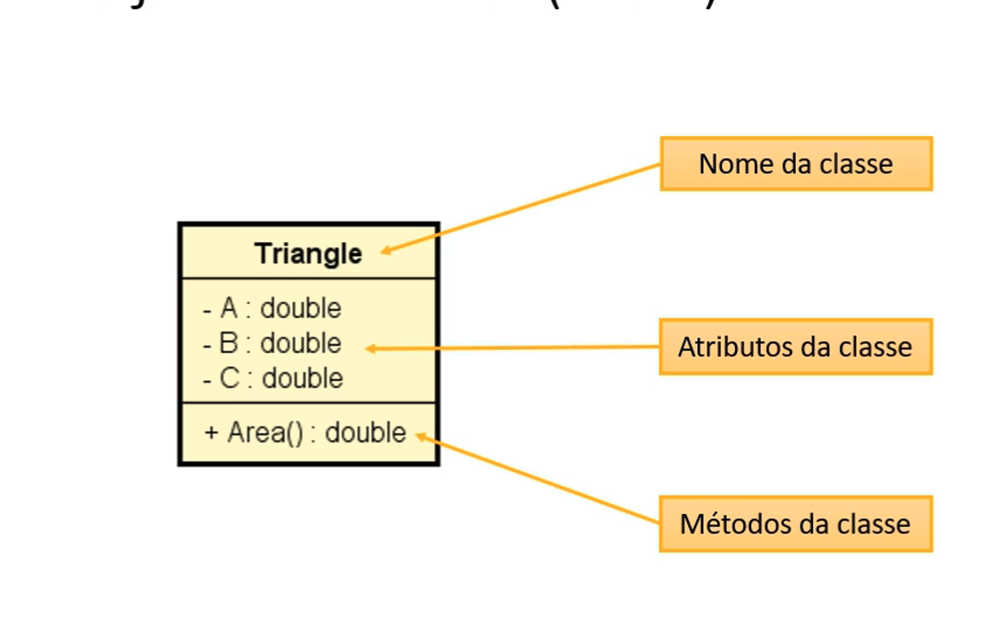

<h1>DOCUMENTAÇAO DO CONTEUDO</h1>

## PROBLEMA EXEMPLO

> Faça um programa para ler as medidas dos lados de dois triânguilos X e Y (suponha medidas válidas). Em seguida, mostrar o valor das áreas dos dois triângulos e dizer qual dos dois triângulos possui a maior área.
>
> A fórmula para calular a área de um triângulo a partir das medidas de seus lados a,b e c é a seguinte (fórmula de Heron):



<h3>Exemplo

```
Enter the measures of triangle X:
3.00
4.00
5.00
Enter the measures of triangle Y:
7.50
4.50
4.02
Triangle X area: 6.0000
Triangle Y area: 7.5638
Larger area:
```

<h1>CLASSE

* É um tipo estruturado que pode conter (membros):
  * Atributos (dados/ campos)
  * Métodos (funções / operações)
* A classe também pode prover muitos outros recursos, tais como:
  * Construtores
  * Sobrecarga
  * Encapsulamento
  * Herança
  * Polimorfismo
* Exemplos:
  * Entidades: Produto, Cliente, Triangulo
  * Serviços: ProdutoService, ClienteService, EmailService, StorageService
  * Controladores: ProdutoController, ClienteController
  * Utilitários: Calculadora, Compactador
  * Outros (views, repositórios, gerenciadores, etc.)



Detalhe do codigo


UML - Projeto de clase



<h1>Discussão


Quais são os benefícios de se calcular a área de uma triângulo por meio de um MÉTODO dentro da CLASSE Triangle?

**1) Reaproveitamento de código:** Nós eliminamos o código repetido (cálculo das áreas dos triângulos x e y) no programa principal.

**2) Delegação de responsabilidades:** Quem deve ser responsável por saber como calcular a área de um triângulo é o próprio triângulo. A lógica do cálculo da área não deve estar em outro lugar.
