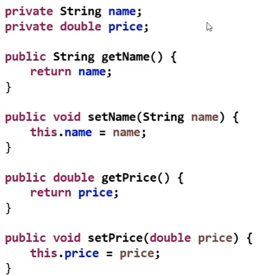
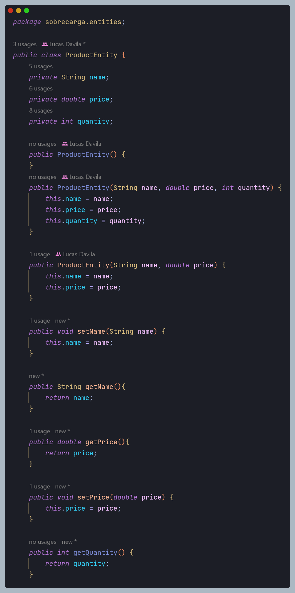

<h1> Encapsulamento

* É um princípio que consiste em esconder detalhes de implementação de uma classe, expondo apenas operações seguras e que mantenham os objetos em um estado consistente.
* Regra de ouro: o objeto deve sempre estar em um estado consistente, e a própria classe deve garantir isso.

<h1> Regra geral básica

* Um objeto **NÃO** deve expor nenhum atributo (modificador de acesso **private**)
* Os atributos devem ser acessados por meio de métodos get e set
  * Padrão JavaBeans: https://en.wikipedia.org/wiki/JavaBeans

<h1> Padrão para implementação de getters e setters

<h2> O que foi feito no app

