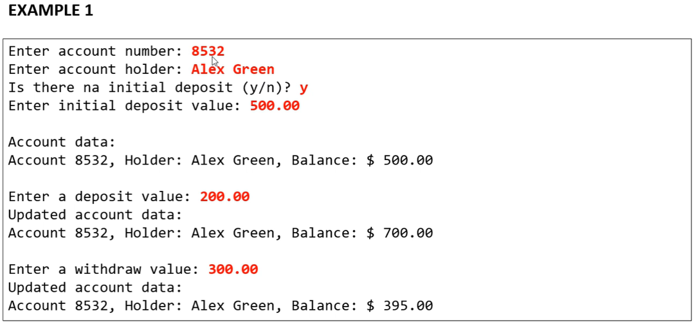
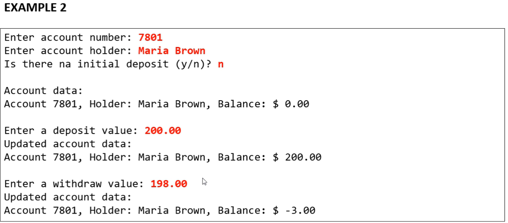

<h1> Exercicio de fixaçao Modulo 9

Em um banco, para se cadastrar uma conta bancária, é necessário informar o número da conta, o nome do titular da conta, e o valor de depósito inicial que o titular depositoou ao abrir a conta. Este valor de depósito inicia, entretanto, é opcionao, ou seja: se o titula não tiver dinheiro a depositar no momento de abrir sua conta, o depósito inicial não será feito e o saldo inicial da conta será, naturalmente, zero.

Importante: uma vez que a conta bancária foi aberta, o número da conta nunca poderá ser alterado. Já o nome do titular pode ser alterado( poius uma pessoa pode mudar de nome por ocasião de casamento, por exemplo).

Por fim, o saldo da conta não pode ser alterado livremente. É preciso haver um mecanismo para proteger isso. O saldo só aumenta por meio de depósitos, e só diminui por meio de saques. Para cada saque realizado, o banco cobra a taxa de $ 5.00. Nota: a conta pode ficar com saldo negativo se o saldo não for suficiente para realizar o saque e/ou pagar a taxa.

Você deve fazer um programa que realize o cadastro de uma conta, dando opção para que seja ou não informado o valor de depósito inicial. Em seguida, realizar um depósito e depois um saque, sempre mostrando os dados da conta após cada operação.

**Exemplos:**

