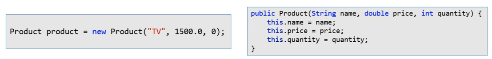
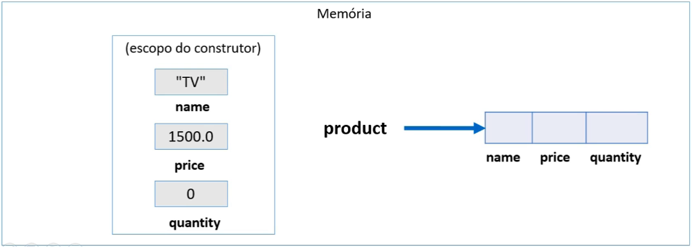
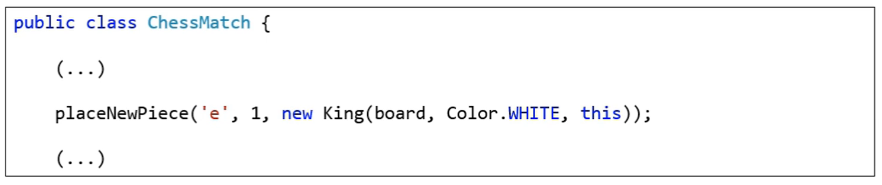

<h1>Palavra This

* É uma referência para o próprio objeto
* Uso comuns:
  * Diferenciar atributos de variáveis locais
  * Passar o próprio objeto como argumento na chamada de um método ou construtor

<h1>Diferenciar atributos de variáveis locais

<h1>Passa o próprio objeto como argumento na chamada de um método ou construtor

